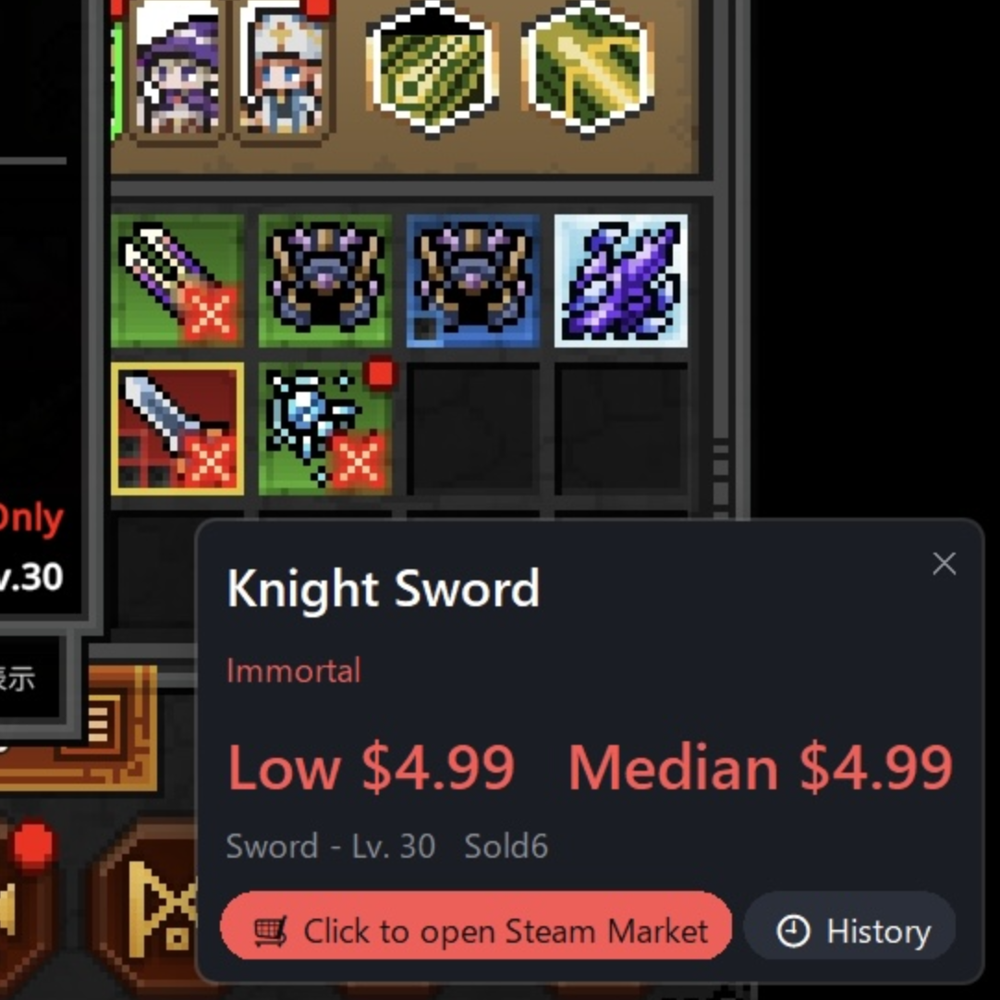
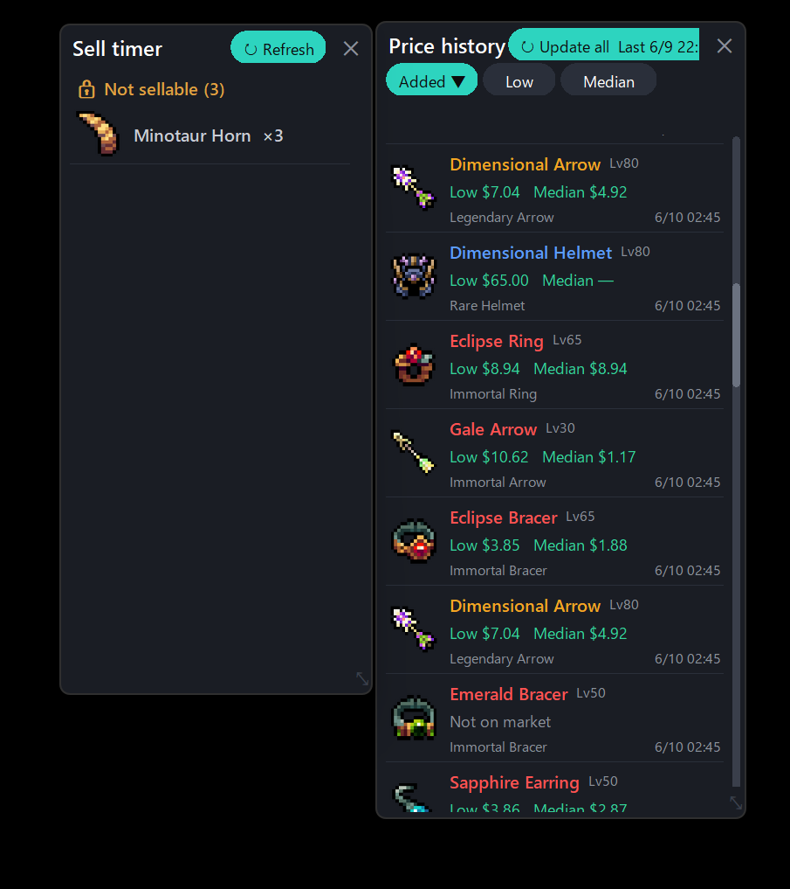

<!-- 言語 / Language -->
[日本語](README.ja.md) · **English** · [中文](README.zh.md)

# TBH MarketLens

**Point at an item in _TBH: Task Bar Hero_, press a key, and its Steam Market price pops up instantly — no name‑typing, no searching.**

by **Ghost Shark Robotics** · UI in 日本語 / English / 中文

  
  

---

## ⬇ Download & run (Windows)

1. Open the **[📥 Releases](https://github.com/GhostSharkRobotics/tbh-marketlens/releases)** page.
2. Under the newest version's **“Assets”**, click the **`.zip`** file (it starts with `TBH-MarketLens`).
3. **Right-click the .zip → Extract All.** Keep the files together in one folder.
4. Run **`TBH MarketLens.exe`** → it sits in your **system tray** (near the clock). A short how-to shows on first run.

> 💡 If Windows shows **“Windows protected your PC,”** click **More info → Run anyway** — the app is unsigned, this is normal. Some antivirus may false-positive on hotkey apps built with PyInstaller; allow it if you trust the source.

---

## What it does

- **Hover an item → press your hotkey → a card shows its Steam Market price** (lowest listing + median), fetched when you ask.
- Reads the item **right under your cursor** via on-screen OCR and matches the game's item database — equipment, gems, engravings, materials and more — with names, rarity and type in **日本語 / English / 中文**.
- **Price history** (tray): sort by added/lowest/median, favourite, rename / fix mis-reads, change rarity, delete, and **update all prices** at once. Saved between sessions.
- **Sell timer** (tray): tracks the listing hold on your Steam inventory and notifies you when items become sellable.
- Rebind the trigger to **any key or combo** (default: mouse **back / side** button). Optional **start with Windows**.

## Is it safe? (anti-cheat)

Yes. MarketLens **only reads what's already on your screen.** It takes an ordinary screenshot (the standard Windows screen capture — the same as any screenshot app), recognizes the item name with OCR, and looks its price up on Steam. It runs as a separate program and **never reads or modifies the game's memory**, so the game's anti-cheat does **not** flag it as a cheat.

## Privacy

Anonymous usage stats only (launches, looked-up item names, errors) tied to a random ID — **never your IP, Steam inventory, or any personal data**. Turn it off anytime in **Settings**.

## Updates

MarketLens checks on startup. When a new version exists, a **⬆ Update** entry appears in the tray/Settings — **one click downloads it, swaps the files, and restarts.** No manual re-download.

---

## Disclaimer

Unofficial, fan-made tool — **not affiliated with, endorsed by, or connected to the game's developer or Valve/Steam.** Provided **“as is,” without warranty of any kind.**

Prices come from the Steam Community Market and **may be inaccurate, delayed, or wrong** (non-USD prices are currency-converted estimates). They are **not trading or financial advice** — always confirm on the Steam Market before you buy or sell. **You use this tool entirely at your own risk; the author accepts no liability for any loss or damage (including from trades, purchases, or sales) arising from its use.**

*by **Ghost Shark Robotics** · optional tip: [☕ Ko-fi](https://ko-fi.com/ghostsharkrobotics)*
